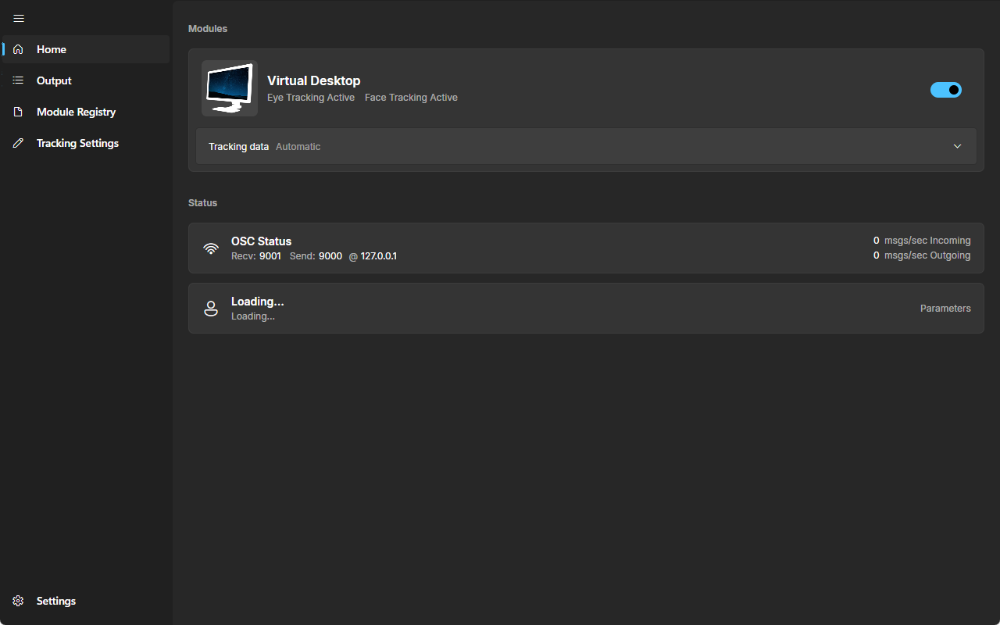
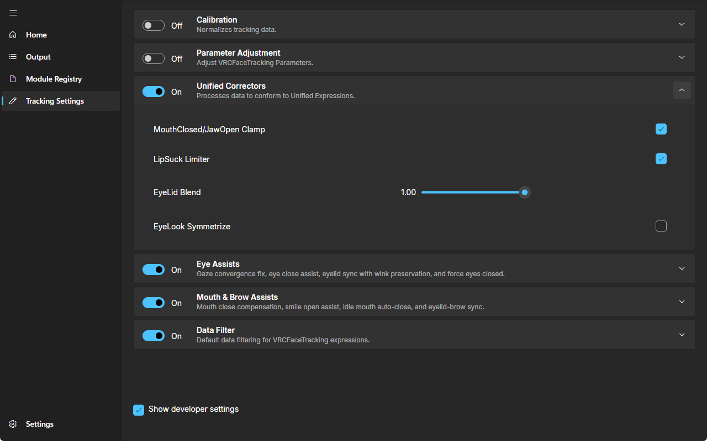

# VRCFaceTracking

Fork of [benaclejames/VRCFaceTracking](https://github.com/benaclejames/VRCFaceTracking) with some
tweaks. Docs for avatars, parameters and modules: [docs.vrcft.io](https://docs.vrcft.io).

Runs on Windows and Linux; macOS builds are experimental. You can run several tracking modules at
once: each module can be limited to the data it should provide (eyes, brows, mouth, tongue, head),
and whatever one module doesn't cover falls to the next. I also added a live view of the module
camera feeds for debugging, under the developer section of the settings page.





## Install

Grab the archive for your OS from the latest release and extract it anywhere.

- Windows: run `VRCFaceTracking.exe`. Settings and installed modules in `%AppData%\VRCFaceTracking`
  carry over from the upstream build.
- Linux: run `./VRCFaceTracking`. Minimal distros also need `libice6` and `libsm6`. Most tracking
  modules only ship Windows binaries, so check your module works on Linux before relying on it.
- macOS: run `./VRCFaceTracking`. If Gatekeeper complains, run
  `xattr -dr com.apple.quarantine <extracted folder>`. SteamVR features are unavailable on macOS.

## Build

Needs the .NET 10 SDK.

```
powershell -ExecutionPolicy Bypass -File build.ps1
```

Apache-2.0, same as upstream. See [LICENSE](LICENSE).
